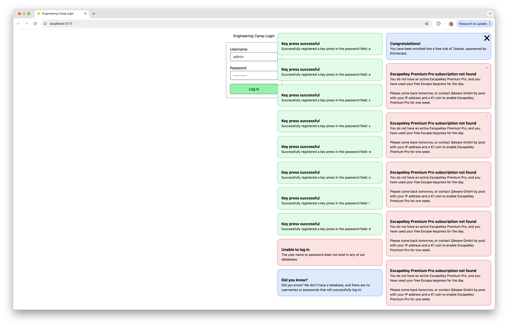

# bad-ui-toasts

This is an entry for the QAware [Worst UI Contest](https://github.com/qaware/worst-ui-contest).

Idea: toasts that decrease the usability to the point of uselessness.

## Screenshot



## Analysis

> > ### UX Qualitätszeile
> >
> > - Zufriedenheit der Nutzer mit dem Tool
> > - Effizienz der Nutzer/ Niedrige Time to Task Completion
> > - Hohe Task Completion Rate
> > - Gesteigerte Ergebnisse durch die Nutzer-Interaktion
> > - Hohe Feature Adoption Rate
> > - Niedrige Error Rate per User
> > - Geringerer Support-Aufwand im laufenden Betrieb
> > - Geringere Produkt-Schulungskosten
>
> Durch diese UI habe ich versucht, so viele dieser Zielen wie möglich zu verletzen.
>
> > - Effizienz der Nutzer/ Niedrige Time to Task Completion
>
> Die Effizienz wird dadurch deutlich verschlechtet, dass die Fehlermeldungen immer ablenken.
> Insbesondere bei kleineren Bildschirmen muss man die Toasts wegklicken, um weiterzumachen.
>
> > - Hohe Feature Adoption Rate
>
> Hier habe ich genau den Gegenteil erreicht, in dem ich ein hilfreiches Feature (Escape-Taste) hinter eine Paywall versteckt habe.
>
> > - Niedrige Error Rate per User
>
> Es ist nicht möglich einzuloggen, weil es keine gültigen Nutzernamen oder Passwörter gibt.
> Das führt dazu, dass es eine Error-Rate von 100 % gibt.
>
> Außerdem wird in jeder sukzessiven Toast-Message der Close-Button kleiner, damit ich auch mit der Zeit schwieriger wird, die Messages wegzuklicken.

## Project Setup

```sh
yarn
```

### Compile and Hot-Reload for Development

```sh
yarn dev
```

### Type-Check, Compile and Minify for Production

```sh
yarn build
```

### Lint with [ESLint](https://eslint.org/)

```sh
yarn lint
```
